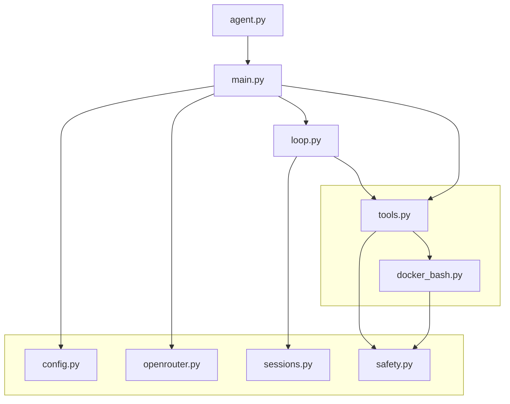
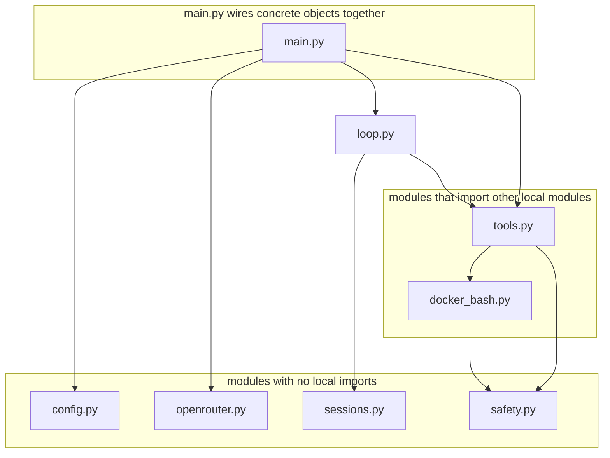

# Simple Agent Architecture

## Import Dependency View

This view starts with `loop.py` because it is the easiest way to understand the
agent's behavior. `main.py` is shown as the wiring layer around it.



## Layered View



## Runtime Loop View

This is what happens after you type a prompt.

```mermaid
sequenceDiagram
    participant User
    participant Main as main.py
    participant Loop as loop.py
    participant OR as ChatClient
    participant Tools as tools.py
    participant Bash as docker_bash.py

    User->>Main: prompt
    Main->>Loop: run_prompt(prompt)
    Loop->>OR: messages + tool schemas
    OR-->>Loop: final text or tool calls

    alt model requested tools
        Loop->>Tools: execute(tool_name, arguments)
        alt bash tool
            Tools->>Bash: run command in Docker
            Bash-->>Tools: exit code + stdout + stderr
        else file tool
            Tools-->>Loop: file result
        end
        Tools-->>Loop: tool result
        Loop->>OR: messages + tool result
    else final answer
        Loop-->>Main: answer
        Main-->>User: print answer
    end
```
